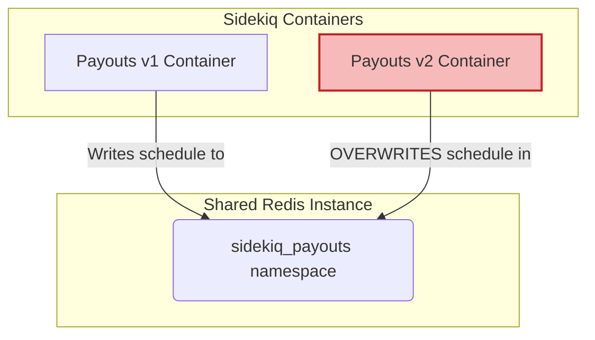
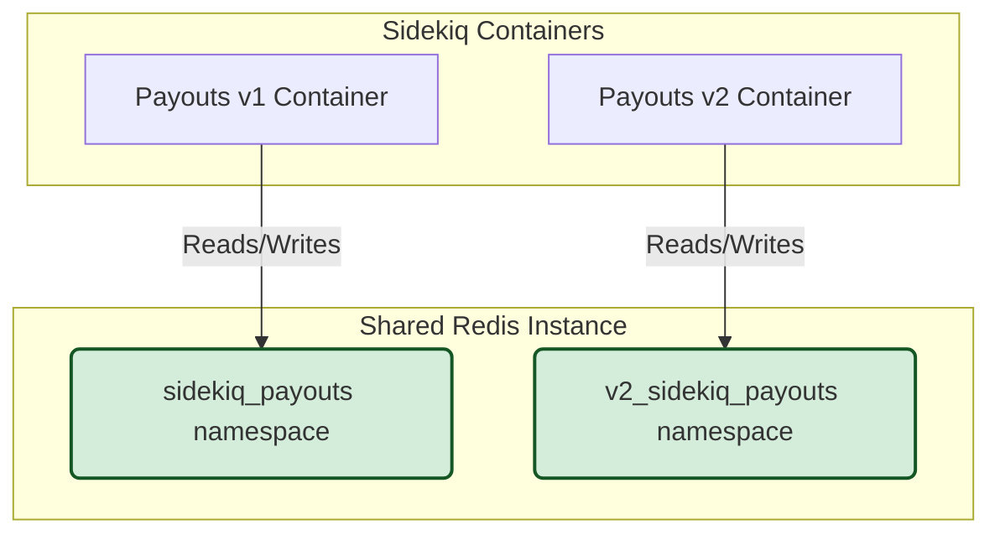

In the project I am currently working on, we have faced some issues lately scheduling [Sidekiq](https://github.com/sidekiq/sidekiq) jobs in one of our applications.

In any case, I must admit that these issues were caused both by bad decisions made in the past and by not having configured these tools properly more recently.

> I will use the [precise terminology](https://github.com/sidekiq/sidekiq/wiki/Best-Practices#4-use-precise-terminology) that the Sidekiq wiki recommends. Therefore, I will not use the term *worker*.

## Context

We started with a legacy payouts application, what we call **payouts v1** (just **v1** from now on).

It is a somewhat old Sinatra application that, among other things, does not use [Zeitwerk](https://github.com/fxn/zeitwerk), so:

* It does not follow a conventional file structure. The namespace of the different classes and modules does not respect the directory hierarchy, so it is common not to find what you expect where you would expect to find it.
* There is no configuration for [inflection](https://github.com/fxn/zeitwerk#inflection), but submodules like AMQP or SFTP exist anyway.
* It does not use *eager loading* in much of the code, so you must require classes and modules explicitly at the beginning of each file.

For a new feature of internal payouts between the company's own accounts, it was decided to do it separately from v1.

The team considered the possibility of making what we call **payouts v2** (just **v2** from now on) as an independent (micro)service that would communicate with v1 through domain events if needed, but the final choice was leaving the source code of v2 in the same repository as v1.

However, it does not follow the classic directory structure of other **monorepos** I have worked on before, where each application has a separate subdirectory. In this case, v1 code is still at the root of the repository, while v2 code is inside a `/v2` directory.

Although v2 is a somewhat more modern application, using Zeitwerk, for example, there is also a lot of logic copied from v1 and adapted as needed. Sidekiq configuration was not copied, though.

In v1, all available queues, their weight, the maximum concurrency, and the queue where each job will run in are explicitly defined:

```bash
bundle exec sidekiq -r ./config/sidekiq_boot.rb -q high_priority,6 -q medium_priority,3 -q low_priority,1 —concurrency 10
```

In v2, nothing is explicitly defined, so by default, all jobs run in the [default queue](https://github.com/sidekiq/sidekiq/wiki/Advanced-Options#queues) with a [concurrency with 5 threads](https://github.com/sidekiq/sidekiq/wiki/Advanced-Options#concurrency):

```bash
bundle exec sidekiq -r ./config/sidekiq_boot.rb
```

Both applications run in separate Docker containers.

Although we also have separate containers to run the background jobs with Sidekiq separately, **both applications share the same Redis instance**. Not only between them, but they also share it with other main applications of the project.

> The team is expected to start working on using a non-shared Redis for the payouts application very soon.

The current configuration has caused us many problems, especially with Sidekiq, although we have faced other problems that we will not discuss here.

In the case of v1, we use the [sidekiq-scheduler](https://github.com/sidekiq-scheduler/sidekiq-scheduler) extension to schedule some Sidekiq jobs:

```ruby
# config/initializers/sidekiq.rb
require "sidekiq"
require "sidekiq-scheduler"

# other logic omitted

redis_config = {
  namespace: "sidekiq_payouts",

  # other keys omitted
}

Sidekiq.configure_client do |config|
  config.redis = redis_config

  # other configurations omitted
end

Sidekiq.configure_server do |config|
  config.redis = redis_config

  # other configurations omitted
end

Sidekiq::Scheduler.enabled = true
Sidekiq::Scheduler.dynamic = true
```

```ruby
# config/sidekiq_boot.rb
require "sidekiq"
require "sidekiq-scheduler"

require_relative "./boot"

# other logic omitted

Sidekiq.set_schedule(
  "bank_acknowledge_notification_job",
  {
    every: "3 minutes",
    class: "Jobs::BankAcknowledgedNotificationJob",
    queue: "high_priority"
  }
)

SidekiqScheduler::Scheduler.instance.load_schedule!
```

## Part I

Recently, a new functionality require us to schedule jobs in v2 as well, and we used the same extension for that purpose.

We started by copying the scheduling configuration, not from v1 but from other more modern project, where the same Redis instance is not shared.

An important detail is that when Sidekiq was configured in v2, the same Redis configuration was kept, including the namespace, for the server and the client:

```ruby
# v2/config/initializers/sidekiq.rb
require "sidekiq"

redis_config = {
  namespace: "sidekiq_payouts",

  # other keys omitted
}

Sidekiq.configure_client do |config|
  config.redis = redis_config

  # other configurations omitted
end

Sidekiq.configure_server do |config|
  config.redis = redis_config

  # other configurations omitted
end
```

In the first approach to schedule jobs in v2, the configuration was something like this:

```ruby
# v2/config/sidekiq_boot.rb
require "sidekiq"
require "sidekiq-scheduler"

require_relative "./boot"

# other logic omitted

Sidekiq.schedule = {
  "bank_transfers_download_feedback_files_job": {
    cron: "0 */5 * * * *",
    class: "Jobs::BankTransfers::DownloadFeedbackFilesJob"
  }
}.freeze

Sidekiq::Scheduler.enabled = true
```

This job is responsible for downloading feedback files from the banks indicating whether the bank transfers were successful or not.

We deployed the changes to production and checked that **the new job was running correctly every 5 minutes**.

> These changes were part of an epic that was still in progress at that moment, so our clients were not yet using them in production.

Coincidentally, the team members involved in this feature had the next day off because it was a public holiday in Madrid.

During our day off, a support ticket was opened reporting that, for some payments from a certain bank, the receipt confirmation had not been sent.

The next day, when we returned to work, we quickly identified the problem: The bank saves the feedback files on the same SFTP server and in the same directory for both processes, with slightly different filename patterns.

The process in v2 was saving a backup copy of those files in an S3 bucket and deleting the files that v1 was supposed to process from the SFTP server.

**The process in v1 runs every 3 minutes**, so in a particular case, the process in v2 got ahead of the process in v1. The same would have happened the other way around if the new feature for v2 would have been used in production.

Both processes use a *filename pattern* to determine if they should process a file.

e.g. `dbdi.000_report_00000000000000000.xml`:

```ruby
# v1 filename pattern
/dbdi.000_report_*/
```

```ruby
# v2 filename pattern
/dbdi\.\d{3}_report_\d{17}\.xml\z/
```

> The filename pattern in v2 is more restrictive but also matches the given filename.

During the QA process of the new feature in v2, we did not notice this problem because it never happened that the process in v1 got ahead of the process in v2.

The solution was quite clear: change the filename pattern in v2, as it includes a different prefix than v1.

However, we first quickly deployed a hotfix to production to prevent the same thing from happening again and thus be able to take enough time to test the change calmly:

```ruby
# v2/config/sidekiq_boot.rb
require "sidekiq"
require "sidekiq-scheduler"

require_relative "./boot"

# other logic omitted

# Sidekiq.schedule = {
#   "bank_transfers_download_feedback_files_job": {
#      cron: "0 */5 * * * *",
#      class: "Jobs::BankTransfers::DownloadFeedbackFilesJob"
#   }
# }.freeze

# Sidekiq::Scheduler.enabled = true
```

> A better approach is to use environment variables for enabling/disabling that functionality, so we would not need a new deployment.

In production, we simply checked that the new job from v2 was no longer running every 5 minutes. Then, we proceeded to apply the change in the filename pattern and re-enabled Sidekiq Scheduler.

```ruby
# v1 filename pattern
/\Adbdi.000_report_*/
```

```ruby
# v2 filename pattern
/\A[A-Z]{3}_dbdi\.\d{3}_report_\d{17}\.xml\z/
```

We pushed the changes, the CI pipeline passed, and we calmly tested in our test environment that the new job from v2 did not process the files for v1.

Approximately 4 hours after having deployed the hotfix, we deployed the new changes to production.

It was then that we started monitoring the scheduled jobs in both v1 and v2.

There we realized that **since the deployment of the hotfix, no scheduled job from v1 had been processed again**.

I'll tell you the reason later in [part II](#part-ii). No spoilers here!

We ran a Rake task in our test environment that shows us the output of `Sidekiq.get_schedule` in v1:

```json
{
  "bank_transfers_download_feedback_files_job": {
     "cron": "0 */5 * * * *",
     "class": "Jobs::BankTransfers::DownloadFeedbackFilesJob",
     "queue": "default"
  }
}
```

There was no doubt. **The scheduler from v2 was overwriting the scheduler from v1**.



We thought then that we could schedule the job from v2 in v1, since we knew that the configuration for v1 had been working well until then:

```ruby
# config/sidekiq_boot.rb

require "sidekiq"
require "sidekiq-scheduler"

require_relative "./boot"

# other logic omitted

Sidekiq.set_schedule(
  "bank_acknowledge_notification_job",
  {
    every: "3 minutes",
    class: "Jobs::BankAcknowledgedNotificationJob",
    queue: "high_priority"
  }
)

Sidekiq.set_schedule(
  "bank_transfers_download_feedback_files_job",
  {
    every: "5 minutes",
    class: "Jobs::BankTransfers::DownloadFeedbackFilesJob"
  }
)

SidekiqScheduler::Scheduler.instance.load_schedule!
```

**Desperate times call for desperate measures.**

We deleted all the configuration for Sidekiq Scheduler from v2 and tested that everything worked.

Note that I said *the configuration*. This is an important detail. More on that later.

To give some more context, when we merge the changes of an [MR](https://docs.gitlab.com/user/project/merge_requests/), they are first deployed to the staging environment. There we were able to check that everything was working as expected by scheduling all the jobs, both for v1 and v2.

We deployed the changes to production and requested in a support ticket to run the same Rake task that before, the one that shows the scheduled jobs.

We confirmed that the output of that task was showing all the scheduled jobs we expected.

That day we finished around 6 p.m. Not bad for a Friday afternoon.

As you may have imagined, this story does not end here.

## Part II

For 10 days, we forgot about the scheduled Sidekiq jobs. There had been 6 deployments to production since that fateful Friday and everything had been working as expected. We had been lucky until then.

With the 7th deployment, which had nothing to do with Sidekiq jobs, our luck ran out.

The day after that deployment, we realized that none of the scheduled jobs had been processed since then.

We first checked what had been deployed to production since the last time we fixed it. Again, nothing related to Sidekiq jobs.

We found the following trace in our logs in production:

> Removing schedule bank_acknowledge_notification
>
> Removing schedule bank_transfers_download_feedback_files_job

We tried restarting the application in production without success. Same trace in the logs.

We had to deploy some changes to production that same morning, so we decided to wait and see if we got lucky again, although we were still trying to figure out the root of the problem. Again, no luck.

That afternoon, the team dedicated the refinement meeting we had scheduled to figuring out what was going on.

Although we had removed the configuration for Sidekiq Scheduler from the Sidekiq container from v2, we were still seeing the [following trace](https://github.com/sidekiq-scheduler/sidekiq-scheduler/blob/master/lib/sidekiq-scheduler/scheduler.rb#L71) in the logs:

> Scheduling Info

We started the application locally and carefully checked the logs, filtering for references to "scheduler".

Finally, we found [the problem](https://github.com/getsentry/sentry-ruby/blob/master/sentry-sidekiq/lib/sentry/sidekiq-scheduler/scheduler.rb#L5) in one of our dependencies:

```ruby
begin
  require "sidekiq-scheduler"
rescue LoadError
  return
end
```

We had deleted the configuration from v2, but **we had not removed the gem from the Gemfile in v2**.

We deployed that change to production and checked that everything was working correctly.

**We had found a race condition**. We had been lucky from the beginning because the Sidekiq container from v1 had been starting after the Sidekiq container from v2.

The moment the Sidekiq container from v2 started after the Sidekiq container from v1, all scheduled jobs from v1 were removed, because v2 had no scheduled jobs.

Of course, we did not carefully read the [gem's documentation](https://github.com/sidekiq-scheduler/sidekiq-scheduler#notes-when-running-multiple-sidekiq-processors-on-the-same-redis), where we would have found the following recommendation:

> If you're running multiple Sidekiq processes on the same Redis namespace with different configurations, you'll want to explicitly disable Sidekiq Scheduler for the other processes not responsible for the schedule. If you don't, the last booted Sidekiq processes' schedule will be what is stored in Redis.

[RTFM!](https://en.wikipedia.org/wiki/RTFM)

And that is the reason why the scheduled jobs from v1 had stopped running when we had disabled Sidekiq Scheduler in v2 with the hotfix.

We also discovered that scheduling jobs from v2 in the Sidekiq container from v1 had worked by chance from the beginning.

The scheduled job from v2 did not have a explicitly defined queue, so it was being processed in the *default* queue. As that queue was not defined in the Sidekiq container from v1, by sharing the same Redis instance and the same namespace, that job had been processed in the Sidekiq container from v2.

## Part III

During one of the tests that the stakeholders did in production of this new functionality, we received an alert in the corresponding Slack channel because an error had been registered during the process of downloading the feedback files from the bank.

We rushed to investigate it and found that the same file had been processed twice.

The first time the process had succeeded, so a record was created in the database with details of the downloaded feedback file, including the filename. The second time an error was registered, because we already had that record in the database for the same filename.

> For now, it is registered as an error, although we should probably change it to a warning later.

Our first thought was that maybe the bank had mistakenly left us the same file on the SFTP server twice. However, that hypothesis did not add up because we only delete files from the SFTP server when the entire process succeeds, and the job is scheduled every 5 minutes, so we should have been registering the exact same error every 5 minutes.

Then we realized that **the same file had been processed twice in a matter of 2 seconds**.

Without finding an apparent reason for this to be happening, we assumed that the cause would be related to still having multiple Sidekiq containers sharing the same Redis namespace.

We already had a task on our board to explicitly add queues to jobs classes and scheduled jobs in v2, so we started from there.

The idea was to deploy it in two steps, doing the following:

1. Define the *default* queue in v1, so that any job from v2 that was already enqueued at the time of deployment could be successfully processed in v1.

```bash
bundle exec sidekiq -r ./config/sidekiq_boot.rb -q default,1 -q high_priority,6 -q medium_priority,3 -q low_priority,1 —concurrency 10
```

And explicitly specify in every job class in v2 in which queue should be processed:

```bash
bundle exec sidekiq -r ./config/sidekiq_boot.rb -C ./config/sidekiq.yml
```

In that configuration file, something like the following is specified:

```yaml
# v2/config/sidekiq.yml
:concurrency: 10
:queues:
  - [v2_high_priority,6]
  - [v2_medium_priority,3]
  - [v2_low_priority,1]
```

In the job class, it is defined as follows:

```ruby
# v2/app/jobs/bank_transfers/download_feedback_files_jobs.rb
require "sidekiq"

module Jobs
  module BankTransfers
    class DownloadFeedbackFilesJob
      include Sidekiq::Job

      sidekiq_options retry: false, queue: "v2_medium_priority"

      # other logic omitted
    end
  end
end
```

Note that when a job is scheduled from v1, a queue from v1 is used, while when the same job is processed in a non-scheduled way, a queue from v2 is used:

```ruby
# config/sidekiq_boot.rb

# other logic omitted

Sidekiq.set_schedule(
  "bank_transfers_download_feedback_files_job",
  {
    every: "5 minutes",
    class: "Jobs::BankTransfers::DownloadFeedbackFilesJob",
    queue: "medium_priority"
  }
)
```

2. Delete the *default* queue from v1, now that all jobs run in a specific queue.

However, with this configuration, we encountered unexpected errors at that time when processing the scheduled job from v2 in v1:

> NameError: Services::BankTransfers::DownloadBatchFiles::Dry

In our services, we use `Dry::Monads` to return `Success` or `Failure`, so it should be enough to add the following:

```yaml
# v2/app/services/bank_transfers/download_feedback_files.rb
require "dry-monads"
```

Indeed, that error was already resolved, but one error after another kept appearing, in what seemed like an endless loop. With each require we added, a new dependency had to be specifically required. Some tests in v1 started to fail due to this problem.

The problem basically is that the v2 files are not autoloaded in v1 because it is not really necessary. In practice, they are independent applications, although we were taking advantage of the fact that both are in the same repository to process jobs from v2 in v1.

A possible solution for the dependency issue is the following:

```bash
bundle exec sidekiq -r ./config/sidekiq_boot.rb -r ./v2/config/sidekiq_boot.rb <...rest omitted>
```

Although that configuration did not solve the problem of the scheduled jobs running twice.

Finally, we opted for implementing another solution that the team had agreed on in another of the tasks that were on our board: **Configure Sidekiq in payouts v1 and v2 to use different Redis namespaces**.

We added sidekiq-scheduler to the Gemfile again in v2 and defined a different namespace for each application:

```ruby
# v2/config/initializers/sidekiq.rb
require "sidekiq"

redis_config = {
  namespace: "v2_sidekiq_payouts",

  # other keys omitted
}

Sidekiq.configure_client do |config|
  config.redis = redis_config

  # other configurations omitted
end

Sidekiq.configure_server do |config|
  config.redis = redis_config

  # other configurations omitted
end
```

```ruby
# v2/config/sidekiq_boot.rb
require "sidekiq"
require "sidekiq-scheduler"

require_relative "./boot"

# other logic omitted

Sidekiq.schedule = {
  "bank_transfers_download_feedback_files_job": {
    cron: "0 */5 * * * *",
    class: "Jobs::BankTransfers::DownloadFeedbackFilesJob",
    queue: "v2_medium_priority"
  }
}.freeze

Sidekiq::Scheduler.enabled = true
```



We also checked that the namespace change only affected Sidekiq. For example, the gem developed by the company to define feature flags uses Redis internally, but uses its own namespace.

We deployed these changes in our test environment and were able to verify that everything worked as expected. We deployed to staging and production and we got the same result.

With this configuration, each Sidekiq container is independent at the namespace level, although they still share Redis between them and with other applications.

We also managed to get the scheduled jobs to run only once.

## Conclusion

We definitely learned the hard way how to configure Sidekiq properly according to our current needs.

It was not easy, it took us a lot of time, but we are happy with the result.

Some lessons learned:

* Better organize the structure of applications that share the same repository.
* Carefully read the documentation of the tools we use.
* Add alerts when a certain period passes without processing scheduled jobs.
* Test any change more exhaustively before uploading it to production.
* Do not share a Redis instance between multiple applications, especially the same namespace, because it can lead to unpredictable behavior.

Thank you for reading, and see you in the next one!

---

%%[buy-me-a-coffee]